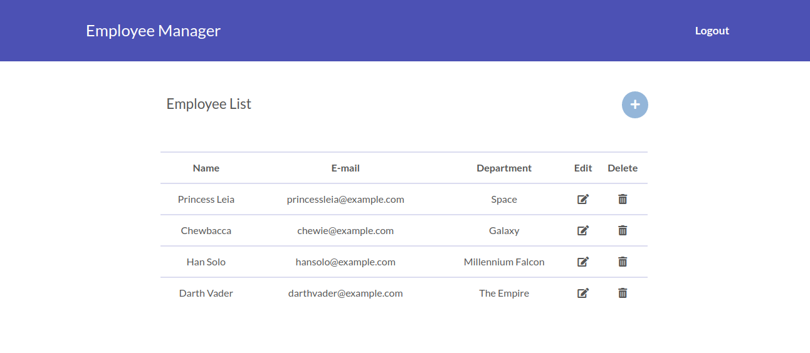

# SSYS Employee Manager


A simple app and API for employee management.

## Installation

## API

```
/api/employees
Allow: GET, POST, HEAD, OPTIONS
Content-Type: application/json
Vary: Accept
```

```
/api/employees/{employeeId}/
Allow: GET, PUT, PATCH, DELETE, HEAD, OPTIONS
Content-Type: application/json
Vary: Accept
```

### Example

```
GET /api/employees/
```
```
HTTP 200 OK
Allow: GET, POST, HEAD, OPTIONS
Content-Type: application/json
Vary: Accept

{
    "count": 1,
    "next": null,
    "previous": null,
    "results": [
        {
            "name": "employee2",
            "email": "employee2@example.com",
            "department": "department2"
        },
    ]
}
```